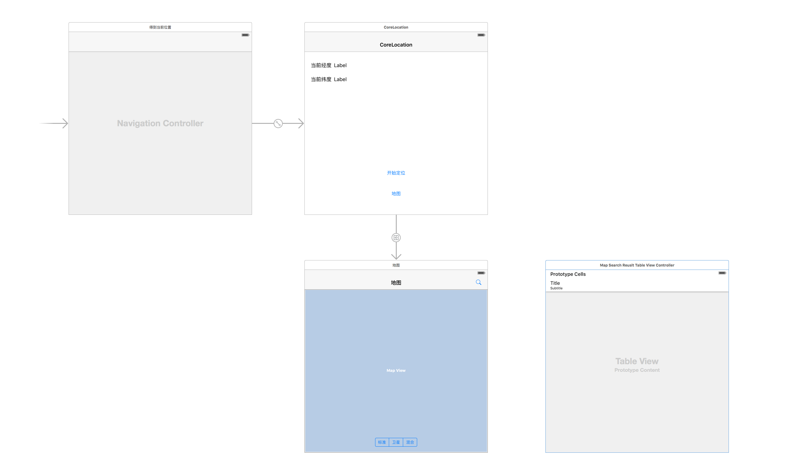

#CoreLocation and MapKit开发教程

本教程主要介绍CoreLocationDemo的开发流程

###1.新建项目

新建项目，只需选择普通的SingleViewApplication即可

###2.编辑Storyboard

在storyboard中拖好页面及其相应控件，具体可参考Demo的storyboard，在本demo中主要有三个页面

1. 一个页面用于显示CoreLocation获得的经纬度信息
2. 一个页面用于显示MapView
3. 还有一个页面用于显示地图的搜索结果

###3.创建ViewController

创建不同的ViewController用以操纵页面控件，并且将代码与相应页面控件绑定

1. CoreLocationViewController与显示经纬度信息的页面绑定
2. MapViewController与显示MapView的页面绑定
3. MapSearchResultTableViewController与显示地图的搜索结果的页面绑定

###4.修改info.plist文件

在info.plist中添加两个字段，分别为NSLocationWhenInUseUsageDescription和NSLocationAlwaysUsageDescription，并为其填入value，value的信息将会在申请定位权限时显示给用户

###5.ViewController代码编写
1. CoreLocationViewController中利用CoreLocation获得定位，并将获得的定位信息显示在页面上
2. MapViewController将用户的当前位置和用户的查找结果大头针显示在MapView上
3. MapSearchResultTableViewController显示用户的查找结果，点击cell后将对应地点显示在MapView中

>>详细代码请在Demo中查看

###6.运行调试

由于虚拟机不支持定位功能，仅能模拟几个不同的地点，所以推荐使用iPhone真机测试，测试查找功能设备需要接入网络